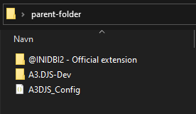
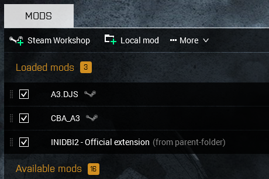

# Instalation guide for pros:
--- 
 

#### _Requirements:_
* [node.js](https://nodejs.org/en/download/)
* [INIDBI2](https://steamcommunity.com/sharedfiles/filedetails/?id=1768992669&searchtext=INIDBI2) (Arma 3 addon)
* [A3DJS](https://steamcommunity.com/sharedfiles/filedetails/?id=2924824356)   (Arma 3 addon)
  
---
 

1) Make a folder looking like this:

`@INDIBI2 - Official extension` -> Local copy of [INIDBI2](https://steamcommunity.com/sharedfiles/filedetails/?id=1768992669&searchtext=INIDBI2)

`A3.DJS-Dev` -> This repo.

`A3DJS_Config.json` -> A copy of the file found [here](A3DJS_Config.json)

 
 

2) Fill out the config file `A3DJS_Config.json`.

3) Run the following commands in the terminal (in this folder):
* `npm install`
* `tsc`

 

4) Launch Arma with these mods:

5) Start a game to initialize the INIDB files.

5) Run `node .` in the terminal.

 
 

**Enjoy!**